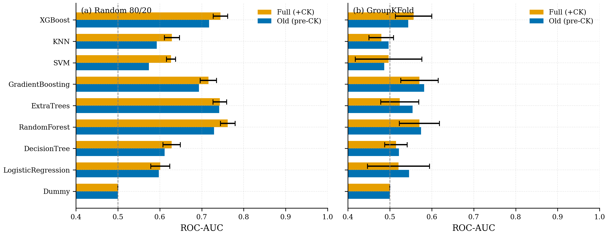
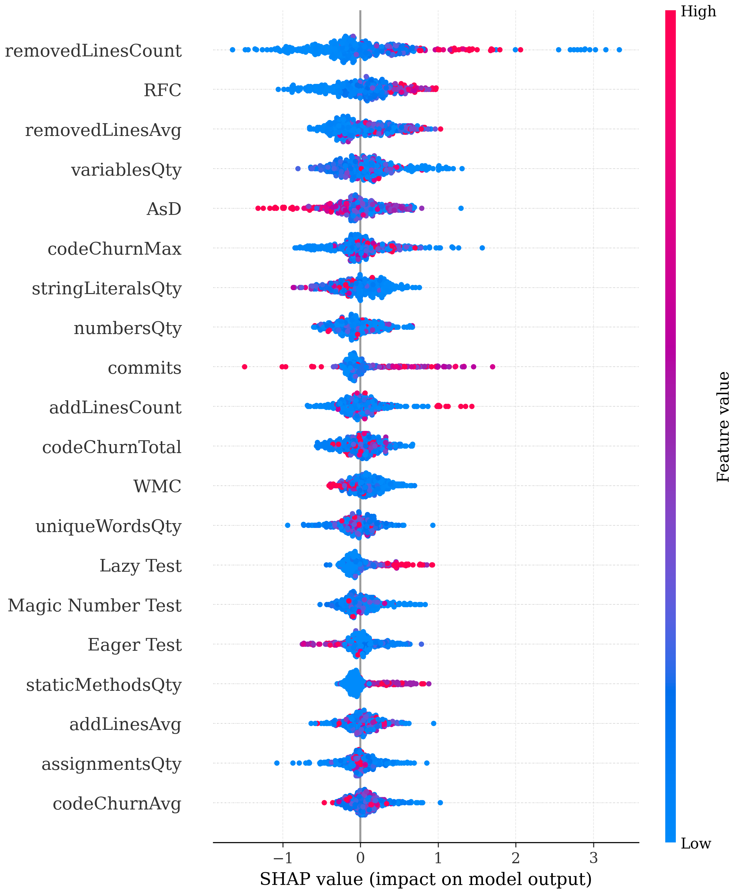

# Tóm tắt: Chỉ số CK có giúp cải thiện dự đoán được lớp kiểm thử nào sẽ được refactor không?

## Bài toán

Khi code lớn lên, các lớp kiểm thử (test) cũng cần được **dọn dẹp/sửa lại cho gọn** (gọi là *refactoring*). Nếu đoán trước được lớp test nào sắp cần sửa, lập trình viên sẽ biết nên tập trung công sức vào đâu.

Bộ dữ liệu gốc (59 project Java) mô tả mỗi lớp test bằng ba loại thông tin: dấu hiệu test xấu (*test smell*), kích thước/độ phức tạp, và **mức độ file bị thay đổi trong quá khứ** (*code churn*: thêm/xóa bao nhiêu dòng, sửa bao nhiêu lần). Bộ này **chưa có** các con số mô tả *cấu trúc* của code (lớp móc nối với nhau nhiều không, kế thừa sâu không, có bao nhiêu method/field...).

**Câu hỏi:** thêm 40 con số cấu trúc đó (gọi là **chỉ số CK**) vào thì đoán có chính xác hơn không?

> **Cách đọc điểm số:** ta dùng **AUC** để đo độ chính xác. **0,5 = đoán bừa**, **1,0 = đoán đúng hoàn hảo**. Càng cao càng tốt.

**Dữ liệu dùng:** 4.414 lớp test từ 53 project. Khoảng 55% có được sửa, 45% không.

---

## Kết quả phụ thuộc vào CÁCH chia dữ liệu để kiểm tra

Có hai cách chia dữ liệu thành phần "học" và phần "thi":

- **Cách A – trộn ngẫu nhiên:** lấy ngẫu nhiên 80% để học, 20% để thi. Vấn đề: cùng một project có thể xuất hiện ở cả hai phần, nên mô hình **đã từng thấy project đó lúc học** rồi mới đi thi → dễ "ăn gian", điểm cao hơn thực tế.
- **Cách B – chia theo project:** học trên một nhóm project, rồi thi trên những project **hoàn toàn mới**. Đây mới giống tình huống thật khi đem mô hình áp dụng cho một project chưa từng gặp.

| | Cách A (trộn ngẫu nhiên) | Cách B (project mới) |
|---|---|---|
| **Chỉ số CK có giúp không?** | **Có** — model nào cũng tăng điểm | **Hầu như không** — 7/9 model giậm chân hoặc tệ đi |
| **Điểm cao nhất đạt được** | 0,762 | 0,557 (không model nào quá 0,59) |

*Bên trái (cách A): thêm CK (thanh cam) nâng điểm ở mọi model. Bên phải (cách B): các thanh tụt sát mức 0,5 và lẫn lộn nhau — phần "giúp" của CK biến mất.*

👉 **Kết luận:** chỉ số CK chỉ trông có ích khi mô hình được "ăn gian" (cách A). Khi đem sang project mới thật sự (cách B), nó gần như vô dụng.

### So sánh chi tiết bằng F1

Bên cạnh AUC. Để chắc chắn, ta xem thêm **F1** — **càng cao càng tốt** (0 = tệ, 1 = hoàn hảo). Bảng dưới là điểm F1 của từng model, trước (chỉ test smell + churn) và sau khi thêm CK, cho cả hai cách chia:

| Model | A: chỉ smell+churn | A: thêm CK | B: chỉ smell+churn | B: thêm CK |
|---|---|---|---|---|
| RandomForest | 0,652 | **0,682** | 0,530 | 0,519 |
| ExtraTrees | 0,663 | 0,677 | 0,512 | 0,476 |
| XGBoost | 0,655 | 0,672 | 0,520 | 0,520 |
| GradientBoosting | 0,632 | 0,651 | **0,535** | 0,523 |
| KNN | 0,565 | 0,590 | 0,489 | 0,468 |
| DecisionTree | 0,612 | 0,628 | 0,516 | 0,509 |
| LogisticRegression | 0,525 | 0,552 | 0,468 | 0,472 |
| SVM | 0,462 | 0,540 | 0,405 | 0,435 |
| Đoán bừa (Dummy) | 0,356 | 0,356 | 0,359 | 0,359 |

Giống với AUC: ở **cách A**, thêm CK nâng F1 ở **cả 8 model**. Nhưng ở **cách B (project mới)**, có tới **6/8 model F1 giảm hoặc đứng yên** sau khi thêm CK — chỉ SVM và LogisticRegression nhích lên chút ít. Điểm F1 tốt nhất ở cách B (0,535) cũng chỉ vừa nhỉnh hơn mức đoán bừa.

---

## Feature thực sự có ích

**Câu trả lời: lịch sử thay đổi của file (code churn).** Đây là loại thông tin duy nhất còn dùng được khi sang project mới. Các con số cấu trúc CK (móc nối, kế thừa, số method/field) khi đứng một mình chỉ đạt điểm quanh 0,5 — tức là **ngang với đoán bừa**.

Thử thêm từng nhóm chỉ số CK vào và xem điểm tăng bao nhiêu:

| Thêm nhóm CK | Tăng (cách A) | Tăng (cách B – project mới) |
|---|---|---|
| Đếm biểu thức trong code | +0,014 | **+0,018** ← nhóm CK *duy nhất* còn ích lợi |
| Số field | +0,011 | +0,000 |
| Mức móc nối (coupling) | +0,010 | +0,003 |
| Các nhóm còn lại | ≤ +0,009 | ≤ +0,008 |
| **Thêm tất cả CK** | **+0,031** | **chỉ +0,002** |

Khi xếp hạng đặc trưng nào quan trọng nhất, **5 vị trí đầu đều là churn** (số dòng bị xóa, tổng/trung bình/đỉnh mức thay đổi...). Đặc trưng CK đầu tiên mãi tới hạng 9 mới xuất hiện.

*Mỗi chấm là một lớp test. Các đặc trưng churn nằm ở những hạng cao nhất. Màu đỏ (giá trị cao) lệch về phải, nghĩa là file càng bị thay đổi nhiều thì càng có khả năng được sửa lại.*

---

## Kết quả

- ✅ **Nếu dùng trong cùng một project (within-project):** thêm chỉ số CK vẫn đáng, vì nó rẻ (chỉ cần chạy [công cụ CK](https://github.com/mauricioaniche/ck)) và có cải thiện thật.
- ⚠️ **Nếu muốn đoán cho project mới (cross-project):** chỉ nên dựa vào **lịch sử thay đổi (churn)**, thêm **đếm biểu thức**. Các chỉ số cấu trúc CK gần như không giúp gì. Chỉ cần **10 đặc trưng** tốt nhất là đã đạt gần bằng dùng cả 78.

---
